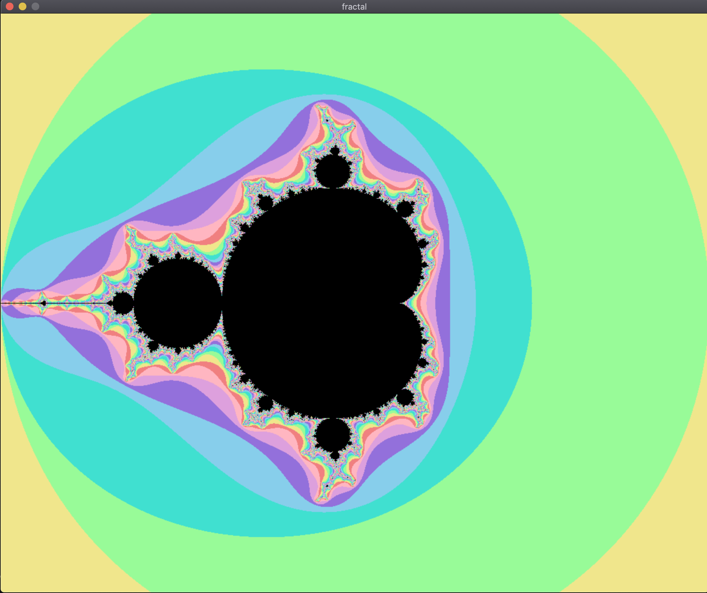
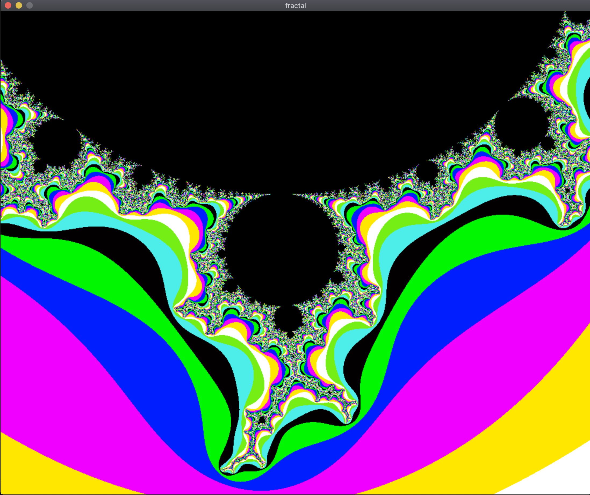
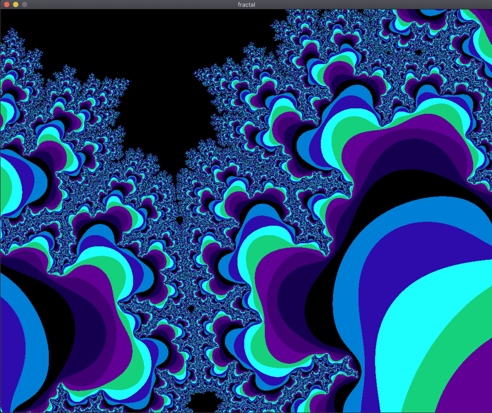
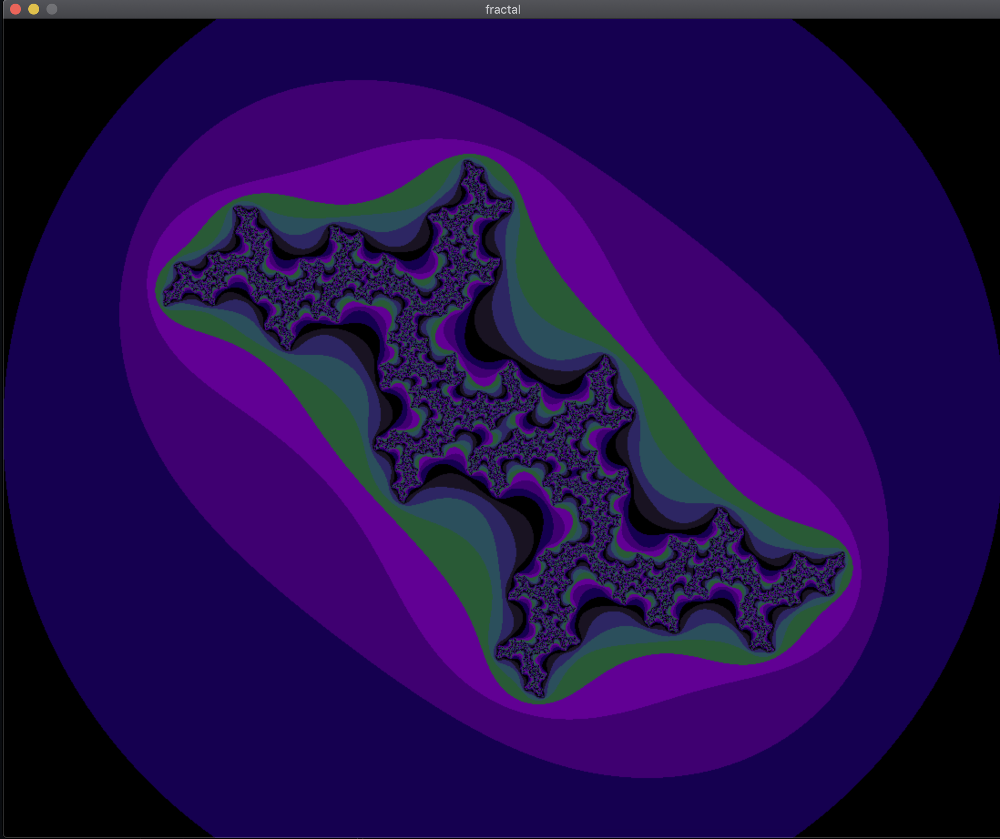
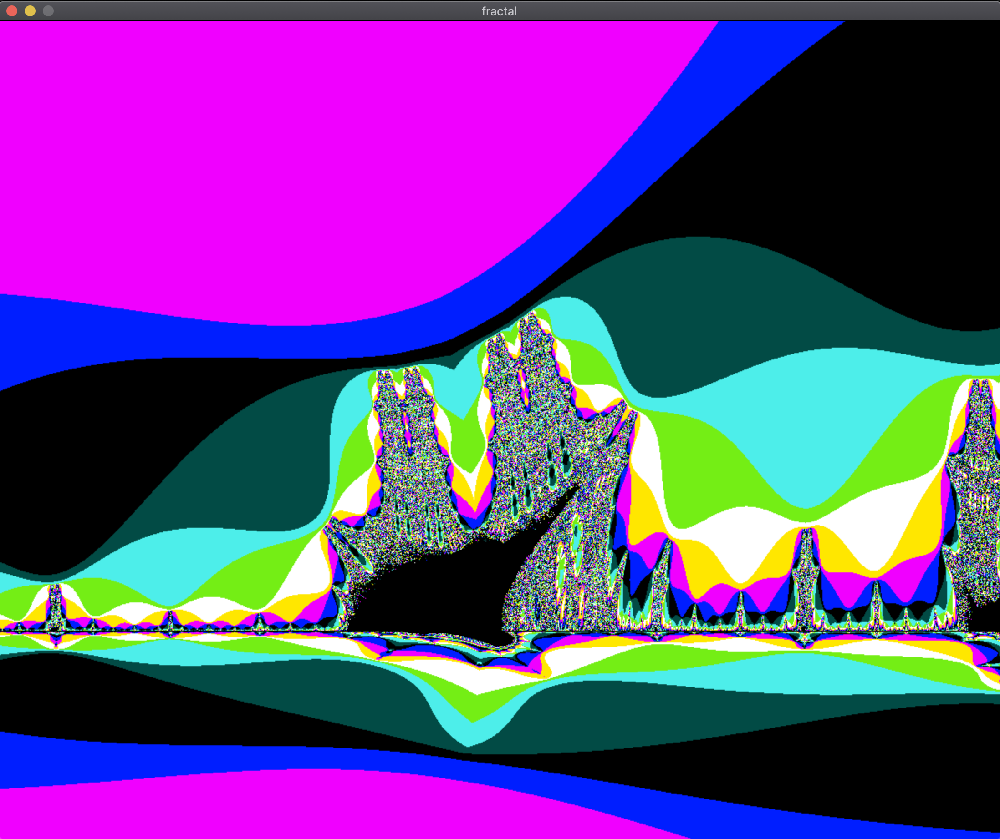

# fract'ol - Computer Graphics Fractals

## Introduction

fract'ol is a small fractal exploration program that allows you to create graphically beautiful fractals using the MiniLibX library. The program offers the Julia set and the Mandelbrot set, and you can create different Julia sets by passing different parameters. The mouse wheel allows you to zoom in and out almost infinitely, exploring the mesmerizing world of fractals.

## Features

- **Rendering:** The program supports the Julia set and the Mandelbrot set, displaying them in a window. The mouse wheel allows for smooth zooming in and out, providing an immersive fractal experience. You can create various Julia sets by passing different parameters to the program.

- **Graphic Management:** The program's window management is smooth, allowing for easy navigation. Pressing ESC or clicking on the window's cross closes the window and exits the program cleanly.

- **Colorful Visuals:** Colors are used to show the depth of each fractal, and psychedelic effects can be applied, making the visuals captivating.

## Getting Started

1. Clone the fract'ol repository to your local machine:

```bash
git clone https://github.com/AfafTarchoun/fractol.git
cd fractol
```
2. Compile the project using the provided Makefile and Run with the following command:
```bash
make
./fractol mandelbrot
```
***if you use ./fractol it will display the available options***

3. For bonus use:

```bash
make bonus
./fractol_b burningship
```
## Keyboard and Mouse Controls
- Use the mouse wheel to zoom in and out on the fractals.
- Use the keyboard arrows to move up and down and to the sides.
- Press ESC or click on the window's cross to close the program.

## Requirements
- The program uses the MiniLibX library, which must be installed on your system.

## Bonus
- Implementing additional types of fractals. (burningship)
- Adding color range shifting for dynamically changing visuals.(colors change with every movement or click)


## Sample Images

Here are some sample images generated with fractol:

### Mandelbrot



### Mandelbrot Zoomed In 1



### Mandelbrot Zoomed In 2



### Julia



### BurningShip


